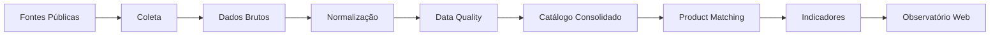

<div align="center">

# 🔎 Observatório de Inteligência de Mercado

### Python • Web Scraping • Pandas • Data Quality • Product Matching • GitHub Pages

Projeto de **Inteligência de Mercado e análise de dados públicos** desenvolvido para coletar, estruturar, validar e comparar informações disponíveis publicamente entre empresas do setor de distribuição.

🌐 [Acessar Observatório Online](https://igorlpc21.github.io/observatorio-inteligencia-mercado/)

</div>

---

## 🎯 Visão do projeto

O projeto transforma dados públicos dispersos em uma estrutura analítica capaz de apoiar análises de:

- cobertura de catálogo;
- qualidade das informações;
- presença de marcas e segmentos;
- sobreposição de portfólio;
- similaridade entre produtos;
- oportunidades de melhoria na disponibilização pública dos dados.

O objetivo não é criar um ranking entre empresas.

A proposta é aplicar **critérios consistentes de análise**, respeitando a granularidade disponível em cada fonte.

---

## 🧠 Competências demonstradas

| Competência | Aplicação no projeto |
|---|---|
| Web Scraping | Coleta estruturada de informações públicas |
| Python | Automação do pipeline analítico |
| Pandas | Tratamento, consolidação e análise dos dados |
| Data Cleaning | Padronização de nomes, unidades e embalagens |
| Data Quality | Auditoria de nulos, duplicidades e inconsistências |
| Data Matching | Identificação de produtos potencialmente semelhantes |
| Text Similarity | Comparação de nomes normalizados |
| Business Intelligence | Construção de indicadores para análise de mercado |
| Data Visualization | Gráficos e interface analítica |
| Front-end | HTML, CSS e JavaScript |
| Deployment | Publicação utilizando GitHub Pages |
| Data Ethics | Uso responsável de informações públicas |

---

# 🏗️ Arquitetura



### Pipeline

```text
Fontes públicas
      ↓
Web Scraping / Extração
      ↓
Dados brutos
      ↓
Tratamento
      ↓
Normalização
      ↓
Auditoria de qualidade
      ↓
Consolidação
      ↓
Matching de produtos
      ↓
Indicadores
      ↓
Observatório Web
```

---

# 📊 Escopo analítico

O recorte atual considera diferentes níveis de informação pública.

| Empresa | Granularidade analisada |
|---|---|
| Fortali Distribuidora | Produto |
| Casa Garcia Gourmet | Produto |
| Milk Distribuidora | Produto |
| Safra Distribuidora | Marca |
| WMix Ceará | Segmento |

Uma decisão importante do projeto foi **não forçar comparações entre fontes com granularidades diferentes**.

Isso evita conclusões que os próprios dados não conseguem sustentar.

---

# 🧹 Data Cleaning

Antes das análises, os dados passam por processos de padronização.

Entre os tratamentos:

```text
normalização de caixa
remoção de acentos
remoção de pontuação
padronização de espaços
tratamento de unidades
extração de quantidade
normalização de embalagens
tratamento de duplicidades
```

Exemplo:

```text
Produto original
   ↓
Normalização
   ↓
Nome padronizado
   ↓
Quantidade-base + unidade-base
```

Essa etapa melhora a qualidade das comparações posteriores.

---

# ✅ Data Quality

O pipeline possui uma etapa específica para avaliar a qualidade dos catálogos.

São verificados pontos como:

- campos vazios;
- códigos inválidos;
- registros duplicados;
- inconsistências de unidade;
- problemas de padronização;
- granularidade da fonte;
- ausência de informações relevantes.

Fluxo:

```text
Dados coletados
      ↓
Auditoria
      ↓
Inconsistências
      ↓
Tratamento
      ↓
Base validada
```

O objetivo é simples:

> **não analisar um dado antes de questionar sua qualidade.**

---

# 🔗 Product Matching

Uma das principais funcionalidades do projeto é a identificação de produtos potencialmente semelhantes entre catálogos.

O processo possui três etapas principais.

### 1. Normalização

```text
Nome original
      ↓
Texto normalizado
```

### 2. Bloqueio por embalagem

Produtos só entram no mesmo grupo de candidatos quando possuem:

```text
mesma quantidade-base
+
mesma unidade-base
```

Exemplo:

```text
1 KG ↔ 1 KG
500 G ↔ 500 G
1 L ↔ 1 L
```

Isso reduz comparações sem sentido.

### 3. Similaridade textual

Após o bloqueio, os nomes são comparados por proximidade textual.

```text
0 ─────────────────────────── 100
baixa                         alta
similaridade                  similaridade
```

---

## 📐 Faixas de similaridade

| Faixa | Pontuação | Uso |
|---|---:|---|
| Alta | ≥ 85% | Forte candidato à revisão |
| Média | 70–84,99% | Similaridade relevante |
| Exploratória | 55–69,99% | Investigação manual |
| Baixa | < 55% | Fora da priorização |

Importante:

> **Similaridade textual não significa equivalência comercial.**

Ela apenas ajuda a priorizar candidatos para investigação.

---

# 🧠 Critério analítico

O projeto foi construído para evitar conclusões além do que os dados permitem.

Por isso:

```text
Ausência de informação
        ≠
Ausência de operação
```

e:

```text
Similaridade textual
        ≠
Produto equivalente
```

Essa separação entre **evidência, hipótese e conclusão** é parte central da metodologia.

---

# 📈 Indicadores

O Observatório consolida indicadores relacionados a:

```text
registros observados
itens únicos
cobertura por empresa
qualidade dos catálogos
granularidade das fontes
pares de similaridade
faixas de similaridade
sobreposição de portfólio
```

Essas informações são apresentadas na interface web.

---

# 🌐 Observatório Web

<div align="center">

### [Acessar aplicação](https://igorlpc21.github.io/observatorio-inteligencia-mercado/)

</div>

A interface foi desenvolvida com:

```text
HTML
CSS
JavaScript
CSV
GitHub Pages
```

Ela permite explorar:

- cobertura dos dados;
- indicadores consolidados;
- qualidade das fontes;
- faixas de similaridade;
- produtos candidatos à equivalência.

---

# 📂 Estrutura

```text
observatorio-inteligencia-mercado/
│
├── dados/
│   ├── brutos/
│   ├── catalogos/
│   └── tratados/
│
├── docs/
├── graficos/
├── relatorios/
│
├── site/
│
├── index.html
├── styles.css
├── app.js
│
├── *.py
├── requirements.txt
│
└── README.md
```

---

# ⚙️ Principais scripts

```text
reconstruir_catalogo_validado.py
auditar_qualidade_catalogos.py
encontrar_produtos_semelhantes.py
gerar_indicadores_observatorio.py
```

Eles representam as principais etapas do pipeline:

```text
consolidação
   ↓
auditoria
   ↓
similaridade
   ↓
indicadores
```

---

# 🛠️ Tech Stack

<div align="center">


<br><br>


</div>

---

# 🔄 Projeto incremental

O Observatório foi estruturado para receber novas fontes.

```text
Nova fonte
    ↓
Coleta
    ↓
Normalização
    ↓
Validação
    ↓
Integração
    ↓
Novos indicadores
```

Isso permite aumentar o escopo do projeto sem reconstruir todo o pipeline.

---

# ⚠️ Limitações

O projeto preserva algumas limitações importantes.

### Preço

Não existe cobertura pública suficiente para comparação confiável de preços.

Por isso não são feitas análises de:

```text
margem
desconto
política comercial
competitividade de preço
```

### Granularidade

As fontes não possuem o mesmo nível de detalhamento.

Por esse motivo, análises são feitas apenas quando os dados são comparáveis.

### Similaridade

O matching é utilizado para **priorização de investigação**, e não para declarar substituição automática entre produtos.

---

# 🔐 Uso responsável

O projeto utiliza informações públicas dentro do recorte analisado.

Entre os princípios adotados:

- registrar a origem dos dados;
- preservar as fontes;
- evitar inferências não sustentadas;
- respeitar diferenças de granularidade;
- manter revisão humana;
- não tratar ausência de dado como ausência de operação;
- revisar aspectos legais e termos de uso antes da coleta.

---

# 🎯 O que este projeto demonstra

```text
Public Data Collection
        +
Web Scraping
        +
Data Cleaning
        +
Data Quality
        +
Data Matching
        +
Market Intelligence
        +
Data Visualization
        +
Web Publishing
```

O resultado é uma solução que transforma informações públicas dispersas em uma base estruturada para **análise de mercado e geração de hipóteses de negócio**.

---

<div align="center">

### Igor Monteiro

**Data Analytics • Business Intelligence • Market Intelligence**

[LinkedIn](https://www.linkedin.com/in/igor-analistadedados) •
[GitHub](https://github.com/igorlpc21)

</div>
